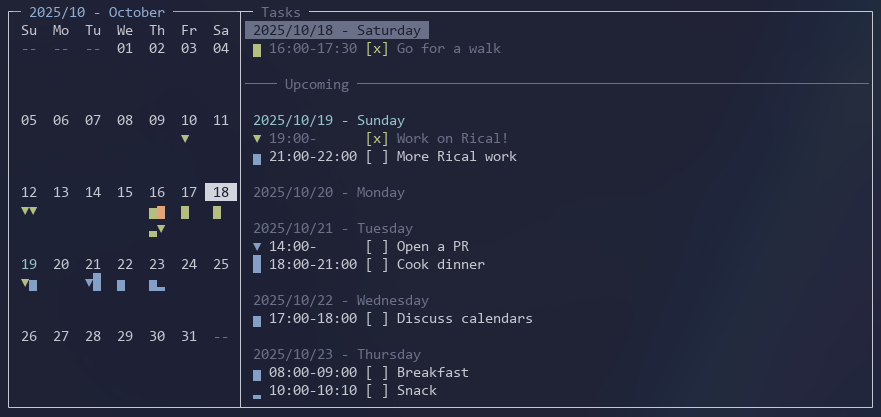

# Rical

The latest calendar app for minimalists.



## Core Objectives
Google Calendar is too slow! If you want these, Rical might be for you:
- Fast keyboard shortcuts
- Lightweight cross-device frontend(s\*)
- A full-scale database that allows multiple accounts, syncing, and availability sharing\*
- System notifications for events\*

\* *Rical is far from complete yet. Check back soon for more features, mark your calendars...*

## Repo Structure
**Rical Backend**
- A friendly and simple API to access and write calendars
- Includes an authentication system for multiple accounts and syncing

**Rical Terminal Client**
- A keyboard-oriented calendar TUI frontend for Rical
- Login, signup, calendar month view and task list, task completion/editing, fast keyboard navigation

**Rical Web Client** *(coming soon!)*
- An intuitive calendar web frontend for Rical, much like existing calendar GUI apps
- Offers the same full functionality as the terminal client (above)
- Useful for managing your calendar from mobile or on devices where you don't want to install the TUI

**Drical (the Daemon for Rical)** *(coming soon!)*
- Offer system notifications once a day for the calendar tasks that will appear that day
- Work cross-platform; constantly run in the background, but be very lightweight
- If the user has not opened their computer/ran Drical for multiple days, show all the tasks that have accumulated over the unviewed days

## Using the Rical Terminal Client
### Starting out
Run the terminal client (see development below) and make sure you're connected to the server.

To create an account, follow the instructions in the main menu.

To exit the app at any time, press `Ctrl+C`.

### Controls (calendar: month pane)
- `h/j/k/l`: navigate between dates
- `o`: "Open" a new task
- `Enter`: "Enter" into the tasks pane from the month pane
- `Ctrl+M`: log out to the "Menu"

### Controls (calendar: tasks pane)
- `Esc`: "Escape" out of the tasks pane into the month pane
- `j/k`: navigate down/up between dates and tasks
- `o`: "Open" a new task
- `e`: "Edit" a currently selected task
- `D` (`Shift`+`d`): "Delete" a task (cut it to your Rical clipboard)
- `p`: "Paste" a task from your rical clipboard into the currently selected date
- `x`: mark a task as done or not done (toggle)
- `Ctrl+M`: log out to the "Menu"

### Controls (input boxes/forms)
These should be what you're familiar with:
- `Backspace`: delete last character
- `Ctrl+Backspace`: delete last word
- `Left`: go to previous character
- `Home`: go to start of input
- `End`: go to end of input
- `Up` or `Shift`+`Tab`: go to previous input box
- `Down` or `Tab`: go to next input box
- `Enter`: submit a form

## Technologies
**Backend**
- Rust 🦀
- PostgreSQL
- Axum

**Rical Terminal Client**
- Rust 🦀
- Crossterm TUI library

**Rical Web Client**
- Coming soon! Libraries and technologies to be determined

**Drical**: coming soon!
- Rust 🦀
- Coming soon! Libraries and technologies to be determined

## Development
**Starting the backend**
- Note: make sure to update the `.env` file and use the correct DB password/other info in these commands
- Run a Postgres database. Do this anywhere, such as in Docker:
```sh
cd backend/src

docker pull postgres:17.6
# In Windows, use 5433 instead of 5432 because of issue
# This is assuming running Docker in WSL
docker run --name rical-db -e POSTGRES_PASSWORD=passwordhere -e POSTGRES_DB=rical_db -e POSTGRES_USER=userhere -e PGPORT=5433 -d -p 5433:5433 postgres

# To go into the db using psql:
docker exec -it rical-db sh
psql rical_db userhere

# To start the container if you've already ran it before:
docker container start rical-db
```
- Start the backend with `cargo run`. Assuming your `DATABASE_URL` is correct, schemas should be loaded into the database automatically via the build script.
- If you want to use the dockerfile, include the args
```sh
docker build . --tag 'rical_backend_test' --build-arg DATABASE_URL=yoururlhere --build-arg JWT_SECRET=yoursecrethere --build-arg PORT=3001
```

**Starting the terminal client**
1. Clone the repository
2. Copy `rical_terminal/.env.example` into `rical_terminal/.env` and set the `API_URL` variable properly.
    - If you're planning on using the officially hosted backend, set it to that URL (coming soon)
    - If you're self-hosting, put the URL that you're running the backend on
3. Run or install with `cargo` by running these commands:
```sh
cd rical_terminal

# To just run the program once
cargo run

# OR, to install to your computer
cargo install --path .
```

## Deployment
Self-hosting the backend is encouraged!
- Using Railway, getting a Postgres database is straightforward: <https://docs.railway.com/guides/postgresql>
- See backend-related steps above
    - You'll need the database running before building the backend
    - Ensure all environment variables are set properly

## Etymology?
The acronym RICAL stands for:
- ***R***ical
- ***I***sn't a
- ***Cal***endar

It's up to you whether you agree.
